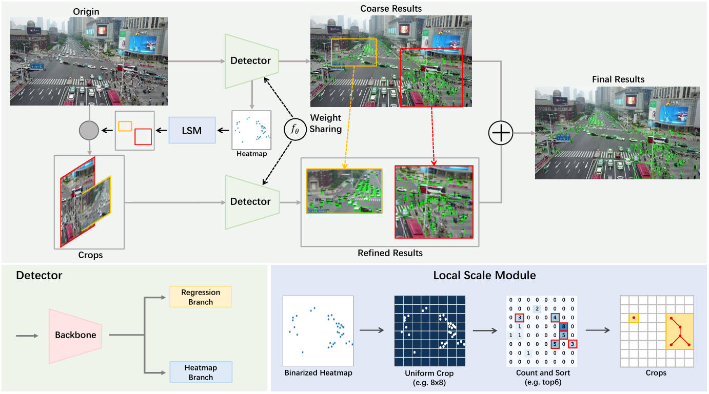
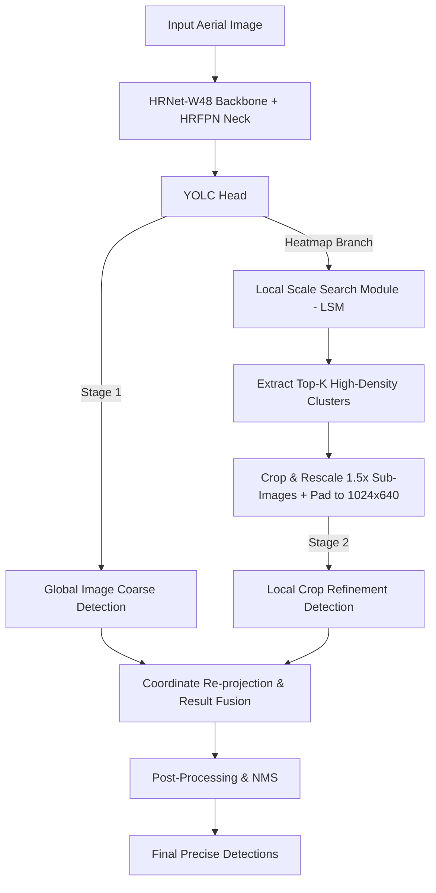
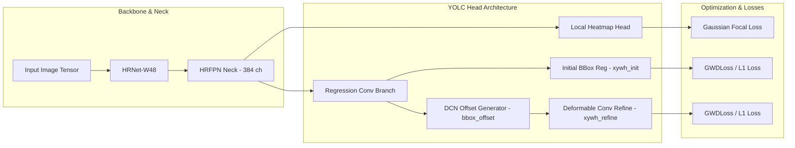

# YOLC: You Only Look Clusters for Tiny Object Detection in Aerial Images

[](https://ieeexplore.ieie.org/document/10530324)
[](https://arxiv.org/abs/2404.06180)
[](https://github.com/open-mmlab/mmdetection)
[](https://www.python.org/)
[](https://pytorch.org/)

Official implementation of **"YOLC: You Only Look Clusters for Tiny Object Detection in Aerial Images"**, published in **IEEE Transactions on Intelligent Transportation Systems (T-ITS), 2024**.

---

<p align="center">
  
</p>

---

## 📌 Executive Overview

Detecting tiny objects (often smaller than \(16 \times 16\) or \(8 \times 8\) pixels) in high-resolution aerial and drone imagery (e.g., VisDrone, UAVDT) poses major challenges for conventional object detectors:

1. **Extreme Downsampling Loss**: Standard backbones aggressively downsample feature maps (e.g., \(32\times\)), causing tiny target signals to fade away completely.
2. **Spatial Sparsity & High Background Ratio**: Objects are concentrated in localized clusters (e.g., parking lots, intersections) while vast regions of aerial images consist of empty background.
3. **High Aspect Ratio & Sub-Pixel Variation**: Standard IoU loss functions suffer from severe gradient vanishing when evaluating tiny bounding boxes with minor pixel shifts.

**YOLC (You Only Look Clusters)** addresses these issues through a **cluster-aware, coarse-to-fine framework**:
- **Local Scale Search Module (LSM)** automatically detects high-density object clusters directly on high-resolution heatmaps.
- **Coarse-to-Fine Dual-Stage Detection Pipeline** crops dense regions, rescales them by a factor of \(1.5\times\), pads them to \(1024 \times 640\), and re-runs localized detection before fusing results back into global image space.
- **HRNet-W48 Backbone + HRFPN Neck** preserves multi-scale spatial representations across all stages without spatial information loss.
- **Gaussian Wasserstein Distance (GWD) Loss** models tiny bounding boxes as 2D Gaussian distributions for smooth, continuous gradient optimization.

---

## ⚙️ Key Features & Innovations

- 🎯 **Cluster-Aware Local Scale Search (LSM)**: Dynamically localizes dense object clusters and calculates optimal sub-region bounding boxes without requiring manual region-of-interest annotations.
- 🔍 **Coarse-to-Fine Local Crop Refinement**: Performs dual-stage detection by replacing coarse predictions in high-density regions with fine-grained detections from rescaled crop regions.
- 🏗️ **High-Resolution Architecture**: Uses HRNet-W48 paired with HRFPN, producing a high-resolution 384-channel feature map optimized for tiny targets.
- 📐 **Deformable Convolutional Head (DCNv2)**: Integrates deformable convolutions (`DeformConv2d`) in `YOLCHead` to adaptively sample object features for non-rigid aerial targets.
- 📐 **Gaussian Wasserstein Distance (GWD) Loss**: Replaces standard IoU/L1 loss with GWD loss (`GWDLoss`), preventing zero-gradient plateaus on tiny bounding boxes.

---

## 🏗️ Architecture & Workflow

### 1. End-to-End System Pipeline



### 2. Deep Learning Component & Loss Formulation



---

## 🧮 Mathematical Formulation

### Gaussian Wasserstein Distance (GWD) Loss

Standard IoU is non-differentiable when bounding boxes do not overlap, and for tiny objects, even a 1-pixel shift can drop IoU from 1.0 to 0.0. YOLC models a bounding box \(\mathbf{B} = (x, y, w, h)\) as a 2D Gaussian distribution \(\mathcal{N}(\boldsymbol{\mu}, \boldsymbol{\Sigma})\):

$$\boldsymbol{\mu} = \begin{bmatrix} x \\ y \end{bmatrix}, \quad \boldsymbol{\Sigma} = \begin{bmatrix} \frac{w^2}{4} & 0 \\ 0 & \frac{h^2}{4} \end{bmatrix}$$

The Wasserstein distance between the predicted distribution \(\mathcal{N}_p(\boldsymbol{\mu}_p, \boldsymbol{\Sigma}_p)\) and ground truth distribution \(\mathcal{N}_g(\boldsymbol{\mu}_g, \boldsymbol{\Sigma}_g)\) is computed as:

$$\mathbf{D}_{W}^2(\mathbf{p}, \mathbf{g}) = \|\boldsymbol{\mu}_p - \boldsymbol{\mu}_g\|_2^2 + \text{Tr}\left(\boldsymbol{\Sigma}_p + \boldsymbol{\Sigma}_g - 2\left(\boldsymbol{\Sigma}_p^{1/2} \boldsymbol{\Sigma}_g \boldsymbol{\Sigma}_p^{1/2}\right)^{1/2}\right)$$

In YOLC (`YOLC/models/losses/gwd_loss.py`), the distance is transformed into a continuous loss function:

$$\mathcal{L}_{\text{GWD}} = 1 - \frac{1}{\tau + \log(1 + \mathbf{D}_W)}$$

where \(\tau = 1.0\). This guarantees smooth, non-zero gradients even for disjoint or sub-pixel bounding boxes.

---

## 🛠️ Tech Stack & Requirements

### System Requirements & Dependencies

| Component | Minimum Version / Detail |
| :--- | :--- |
| **OS** | Linux / Windows |
| **Python** | \(\ge 3.8\) |
| **PyTorch** | \(\ge 1.7.0\) |
| **CUDA** | \(\ge 11.0\) (CUDA-enabled GPU recommended) |
| **MMDetection** | `2.26.0` (compatible with \(\ge 2.17.0, < 3.0.0\)) |
| **MMCV** | `mmcv-full` matching PyTorch & CUDA versions |
| **Kornia** | `0.6.9` |
| **OpenCV** | `opencv-python` |
| **PyCOCOTools** | `pycocotools` |

---

## 🌐 Real-World Applications & Use Cases

1. 🚁 **UAV Urban Traffic & Pedestrian Monitoring**: Accurately counts and detects tiny cars, motorcycles, and pedestrians from high-altitude drone cameras in dense city intersections.
2. 🚨 **Search and Rescue (SAR)**: Identifies lost individuals, small vehicles, or debris across vast wilderness, mountain, or disaster zones in aerial survey images.
3. 🏙️ **Smart City & Aerial Infrastructure Surveillance**: Monitors parking lot occupancies, highway congestion, and illegal parking without requiring ground camera infrastructure.
4. 🌊 **Maritime & Coastal Safety Reconnaissance**: Detects small boats, jet skis, kayaks, and swimmers across wide bodies of open water.
5. 🌾 **Precision Agriculture**: Enables automated counting of livestock, farm machinery, and crop health markers from agricultural drone surveys.

---

## 🚀 Step-by-Step Execution Guide

### 1. Environment Setup

Create a conda environment and install the required dependencies:

```bash
# Navigate to YOLC project directory
cd YOLC

# Create and activate conda environment
conda create -n yolc python=3.8 -y
conda activate yolc

# Install PyTorch (adjust CUDA version to match your system)
pip install torch==1.10.1+cu113 torchvision==0.11.2+cu113 -f https://download.pytorch.org/whl/cu113/torch_stable.html

# Install MMCV-full and MMDetection
pip install -U openmim
mim install mmcv-full==1.6.0
pip install mmdet==2.26.0

# Install additional requirements
pip install kornia==0.6.9 opencv-python pycocotools tqdm
```

---

### 2. Dataset Preparation

Download the **VisDrone2019-DET** dataset and set up the directory structure under `YOLC/data/VisDrone2019/`:

```
YOLC/data/
└── Visdrone2019/
    ├── VisDrone2019-DET-train/
    │   ├── images/
    │   └── annotations/
    └── VisDrone2019-DET-val/
        └── images/
```

Generate the cluster crop dataset and COCO-format annotations using `gen_crop.py`:

```bash
python gen_crop.py
```

*This script will generate crop images in `data/Visdrone2019/VisDrone2019-DET-train-crop/images` and annotations in `data/Visdrone2019/VisDrone2019-DET_train_coco_1crop.json`.*

---

### 3. Model Weights / Checkpoints

Download the pre-trained YOLC checkpoint file:
- **Download Link**: [Google Drive Weight Checkpoint](https://drive.google.com/file/d/1WDd77NYf8EXNaWKJuV9LfqCT9zdHajwG/view?usp=sharing)
- Place the downloaded checkpoint file into `YOLC/work_dirs/yolc/epoch_xx.pth` or update the path in `eval_yolc.py`.

---

### 4. Training

#### Single-GPU Training
To train YOLC on a single GPU:

```bash
python train.py configs/yolc.py --gpu-id 0
```

#### Multi-GPU Distributed Training
To train YOLC using PyTorch distributed training across multiple GPUs (e.g., 4 GPUs):

```bash
./dist_train.sh configs/yolc.py 4
```

---

### 5. Evaluation

Evaluate model performance on the VisDrone validation set with LSM cluster crop refinement:

```bash
# Note: You can adjust saved_crop in eval_yolc.py (e.g., saved_crop=0, 1, 2, 3 corresponding to k crops)
python eval_yolc.py
```

---

### 6. Inference on Custom Images

You can run YOLC programmatically on custom aerial images using `inference_YOLC.py`:

```python
from mmdet.apis import init_detector
from inference_YOLC import inference_detector_with_LSM

config_file = 'configs/yolc.py'
checkpoint_file = 'work_dirs/yolc/epoch_xx.pth'

# Initialize YOLC detector
model = init_detector(config_file, checkpoint_file, device='cuda:0')

# Run inference with Local Scale Search Module (LSM)
cluster_regions, detection_results = inference_detector_with_LSM(model, 'path/to/aerial_image.jpg')
```

---

## 📂 Repository Structure

```
.
└── YOLC/
    ├── configs/
    │   └── yolc.py                 # YOLC configuration (HRNet-W48, HRFPN, YOLCHead, GWDLoss)
    ├── models/
    │   ├── backbones/
    │   │   └── vit.py              # Backbone utilities
    │   ├── dense_heads/
    │   │   └── yolc_head.py        # YOLC Head with DCNv2 and LSM cluster detection
    │   ├── detectors/
    │   │   └── yolc.py             # YOLC Detector class (SingleStageDetector)
    │   └── losses/
    │       └── gwd_loss.py         # Gaussian Wasserstein Distance (GWD) Loss
    ├── annotations/
    │   └── VisDrone2019-DET_val_coco.json  # Validation dataset COCO annotation file
    ├── VisDrone_Dataset.py         # VisDrone Dataset registration for MMDetection
    ├── gen_crop.py                 # Cluster crop generation script using LSM
    ├── train.py                    # Training entrypoint
    ├── test.py                     # Standard MMDetection testing script
    ├── eval_yolc.py                # Dual-stage coarse-to-fine evaluation script
    ├── inference_YOLC.py           # Helper inference functions with LSM support
    ├── dist_train.sh               # Distributed GPU training script
    └── framework.jpg               # YOLC framework diagram
```

---

## 📜 Citation

If you find YOLC helpful in your research or project, please consider citing the original paper:

```bibtex
@article{liu2024yolc,
  title={YOLC: You Only Look Clusters for Tiny Object Detection in Aerial Images},
  author={Liu, Chenguang and Gao, Guangshuai and Huang, Ziyue and Hu, Zhenghui and Liu, Qingjie and Wang, Yunhong},
  journal={IEEE Transactions on Intelligent Transportation Systems},
  volume={25},
  number={10},
  pages={13863-13875},
  year={2024},
  publisher={IEEE}
}
```

---

## 📄 License

This repository is licensed under the [Apache 2.0 License](LICENSE).
